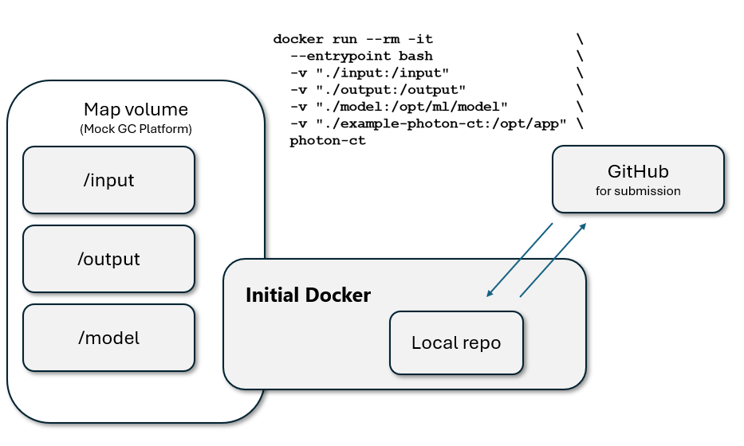
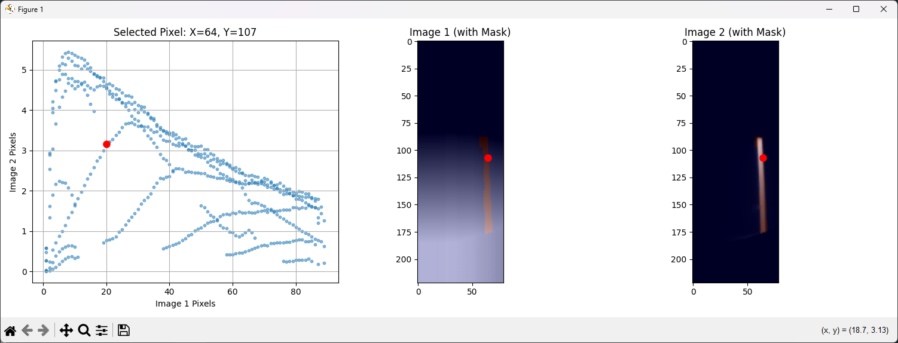

# DoseRAD2026 Summary

This is a summary for the participation for the [DoseRAD2026](https://doserad2026.grand-challenge.org/) summary. The final code experienced out-of-memory errors but there are many things learnt along the way.

## Task
Given the CT and beam geometry, predict the dose. There are two imaging modalities (CT and MRI) and two beam types (photon and proton) making it four streams in total.
*   Photon: VMAT with 180 control points
*   Proton: 500 beams
> The keyword is **real-time** so there's a high emphasis on the speed.
*   Data: [https://huggingface.co/datasets/LMUK-RADONC-PHYS-RES/DoseRAD2026](https://huggingface.co/datasets/LMUK-RADONC-PHYS-RES/DoseRAD2026)
*   Evaluation code: [https://github.com/DoseRAD2026/evaluation-setup](https://github.com/DoseRAD2026/evaluation-setup)
*   My devepopment code: [https://github.com/sunyu0410/DoseRAD2026Dev/tree/photon\_ct](https://github.com/sunyu0410/DoseRAD2026Dev/tree/photon_ct)
*   Submission code: [https://github.com/sunyu0410/example-photon-ct](https://github.com/sunyu0410/example-photon-ct)

[Winner's method](src/winner.pdf) is based on [Xieo et. al.'s work](src/xiao.pdf)
* https://github.com/LMUK-RADONC-PHYS-RES/DL-segment-dose-calculation
* BEV based

## On Docker Submission
The basic unit for submission is an **algorithm.**
*   Each algorithm is linked with a Docker image.
    *   Either submit the `tar.gz` file of the Docker image or
    ```plain
    docker save your_image_name:latest | gzip > your_algorithm_name.tar.gz
    ```
    *   Link with GitHub repo and use the Grand Challenge (GC) platform to build the image.
        *   Every time a commit is tagged, it will trigger the GC to build the image automatically.
        *   You can create a tag on GitHub website or using the command:
        ```plain
        git tag -a v2.1.1 -m "Test run OK locally"
        git push origin v2.1.1
        ```
*   The model can be either wrapped inside the Docker image or provided on GC by uploading the model `tar.gz` file. In this case it will be untar to `/opt/ml` in the image, where the code can access. Make sure there's no parent folder in the tar file.

```erlang
# -C means change directory first
# hence the tarfile won't have <model-dir> in it
tar -czf model.tar.gz -C <model-dir> .

# To untar and verify
tar -xzf model.tar.gz
```

*   To make things load faster in the Docker, pre-compile the your Python files to `.pyc`

```coffeescript
# Pre-compile the user directory and algorithm code
# Use pip show ... to get the user pip directory
RUN python -m compileall /home/user/.local/lib/python3.11/site-packages
RUN python -m compileall /opt/app/
```

## Docker setup for developing algorithm

It can take up to an hour for GC to compile before the algorithm is usable. Hence getting error feedback from GC is time-consuming. Instead you can mock the GC behaviour locally. This will make sure the plumbing is correct (not accounting for RAM or speed though).
*   First, submit a validation run, which you'll have the input files and their structure. Download them.
*   Make a build from the Docker on the example Dockerfile (with necessary pip isntalls, etc.). We'll use it for an interactive runtime for constructing the submission code.
*   Git clone the submission algorithm repo to local, in this case, `example-photon-ct`
*   Run the Docker locally and map the input, output, model and the algorithm repo to the container. Any modification to the repo inside Docker will persist locally.

```bash
docker run --rm -it                 \
  --entrypoint bash                 \
  -v "./input:/input"               \
  -v "./output:/output"             \ 
  -v "./model:/opt/ml/model"        \
  -v "./example-photon-ct:/opt/app" \
  photon-ct
```

> Windows cmd will have problem mapping the volumes. Hence use an Ubuntu shell. The drives are under `mnt` , e.g. `/mnt/c/Users/Sun Yu/OneDrive - Peter Mac/Desktop/docker_sim`
*   Commit changes to the repo and push it back to GitHub.
*   Make tags as necessary to build the Docker on GC.
*   Wrap up the `model` folder

```erlang
tar -czf model.tar.gz -C <model-dir> .
```

## What's achieved
### Developed a few useful tools
1. Sub-voxel accuracy rotation using torch `grid_sample`
    *   Existing tools can only take int as rotation centers
2. Voxel inspector

This is to inspect the scatter plot while pointing out the actual location on the image.


3. MLC calculator based on the leaf position and project to all slices in an sitk image.

4. Perspective transform. See `photon-ct-3d` branch `bev/persp/perspective_numpy.ipynb`.

## What's lacking
1. Building infrastructures more efficiently.
    1. About 80% spent on building tools from scratch and verify they're correct.
    2. `monai` has lots of useful transforms which can do what's implemented
        1. Any pytorch layer can be used as a transformation
        2. For expensive calculation, use cached dataset to speed up the dataloader
        3. Utilise the sliding window inferencing under VRAM constraints
    3. `cupy` seems to be a popular option for speeding up things
2. Model training
    1. Always look at the hosts' recent work. Especially for fast developing fields.
    2. Leave more time for model training
    3. Apply reproducible training (seed with if possible and utilise `tensorboard` for systematic monitoring

## Some notes about speeding things up
1. Try CUDA-accelerated libraries, like `cupy`
2. Pre-compile python files to `.pyc` in Docker. So that Python doesn't need to compile them during import.
3. During inference, use the new `torch.inference_mode()` which is more suitable than `torch.no_grad()`
4. Use multi-threading for IO bound operations, e.g. file reading / saving. But note that using too many threads will slow things down as the cost for coordinating increases.
5. Explore the limit of GPU usage to maximise the batch size.
6. In dataloader, optimise `n_workers` and `prefetch_factor` .
